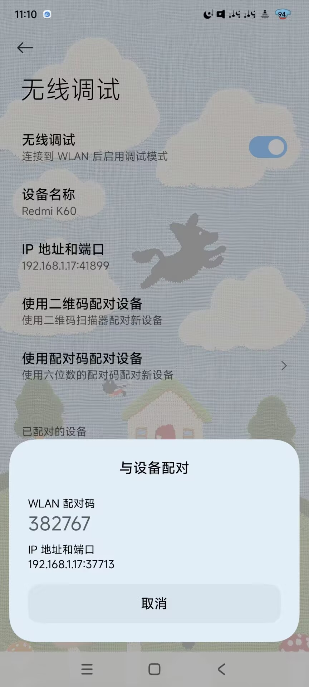
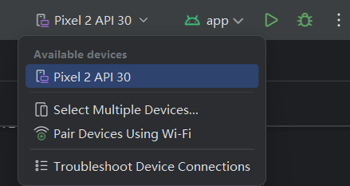
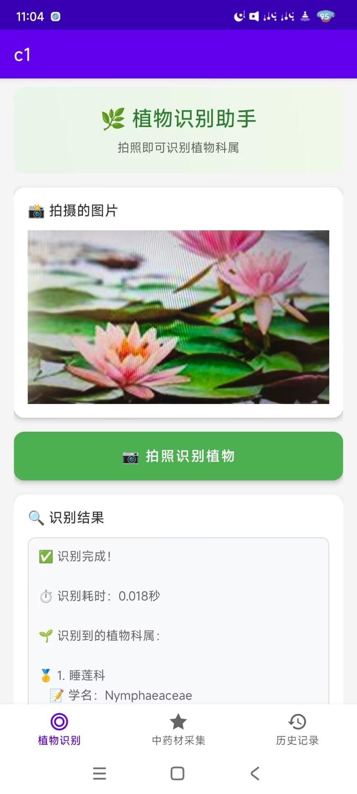
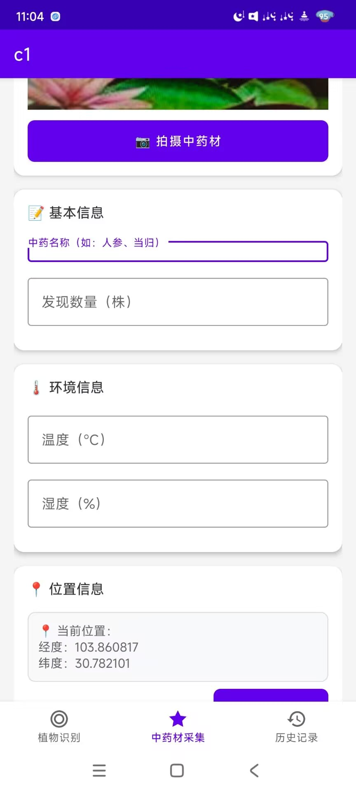
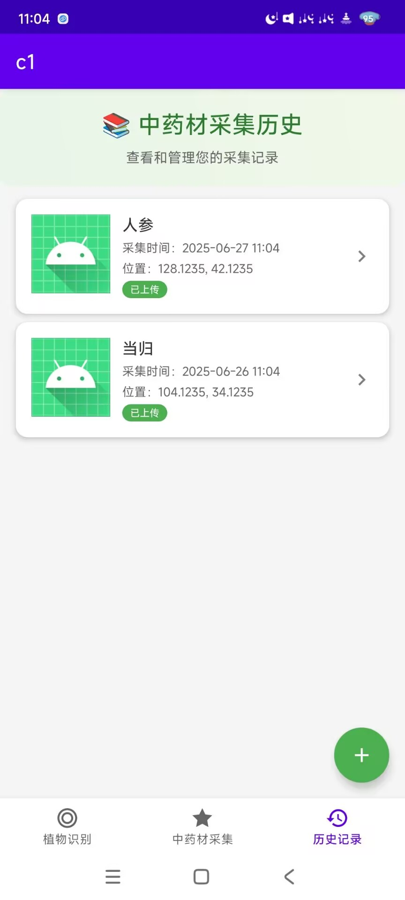

# plantapp

这是一个使用andriod原生框架开发的《中草药信息采集与识别app》

### 额外配置

创建文件app/src/main/java/com/example/c1/OssConfig.kt

内容：以下内容全部根据自己的阿里云OSS配置更改

```gcode
package com.example.c1

object OssConfig {
    const val ENDPOINT = "oss-cn-hongkong.aliyuncs.com"   
    const val BUCKET_NAME = "你的bucket名"
    const val ACCESS_KEY_ID = "你的access_id"
    const val ACCESS_KEY_SECRET = "你的access_key"
    const val OSS_URL_PREFIX = "https://qingkaka.oss-cn-hongkong.aliyuncs.com/"
}
```

将app/src/main/java/com/example/c1/OssConfig.kt加入根目录下的.gitingore避免github追踪。

setting.gradle.kts和项目gradle目录下wrapper/gradle-wrapper.properties里的配置可以加速依赖下载。

app/src/main/java/com/example/c1/ApiConfig.kt文件修改为自己本机配置：

```gcode
package com.example.c1

object ApiConfig {
    //真机替换为电脑的ip:port
    const val BASE_URL = "http://192.168.1.12:8090/"
    // 植物识别服务地址（请根据实际情况修改）
    const val PLANT_IDENTIFY_URL = "http://192.168.1.12:5000/api/identify"
} 
```

运行中草药系统后端和植物识别后端；植物识别后端app.py文件修改为处理image_url的操作。

### 调试

使用andriod studio运行调试：分为仿真机调试和真机调试
采用真机无线调试
首先打开手机开发者模式，打开无线调试，确保手机和电脑处于同一局域网内



指令1（只需要执行一次，配对即可）：**adb pair 192.168.1.17:37713**    （图中“与设备配对”的IP和端口，并输入配对码）
Enter pairing code: **382767**
Successfully paired to 192.168.1.17:37713 [guid=adb-c9931dc7-xbHbYA]

指令2（若手机下线则需要重新执行）：**adb connect 192.168.1.17:41899** （实际IP和端口）
connected to 192.168.1.17:41899

指令3（查看设备状态）：**adb devices**
List of devices attached
192.168.1.17:41899 device
adb-c9931dc7-xbHbYA._adb-tls-connect._tcp device

连接成功后，在andriod studio中run  左侧可以选择仿真机Pixel或者真机redmi等等



运行效果：


运行植物识别功能时，需要运行“识别项目的app.py”

记得修改本项目代码中请求的IP地址和端口为实际IP+端口